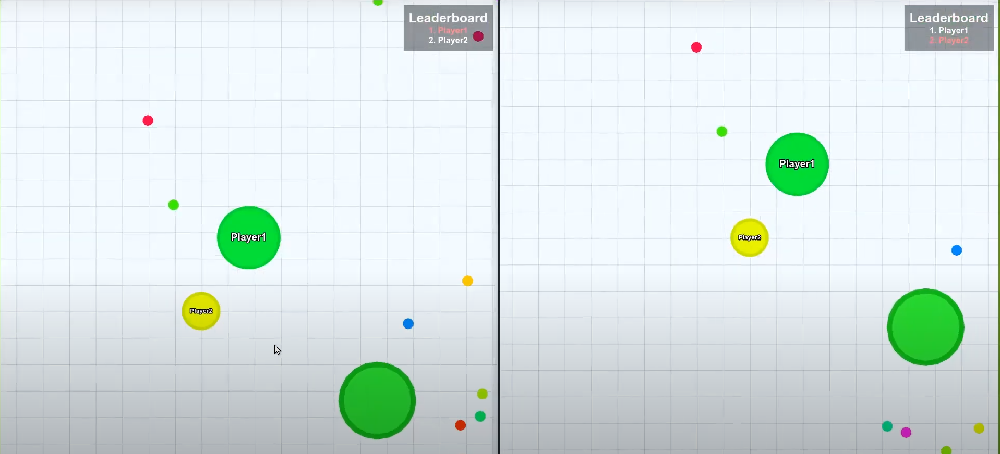

# EE599_Final_Project
Yingnan Wang &amp; Jiawei Wu 's EE599 final project 

## Screenshot


Biography_of_Hero_Agar
=========================

EE599 final project built with socket.IO and HTML5 canvas on top of NodeJS.

##  Basics
- Use keyboard `↑`,  ` ←`, `↓`,  `→` to move the pot.
- Move the mouse to control the pot.
- Eat food and fight with enemies in order to make your character bigger and stronger.
- Variable **mass** is the number of food that had been eaten.
- **Objective**: Survive and eat food to grow up to defeat enemies.

## Rules
- The more food you eat, the bigger you are and the slower you move.
- Type`-ping` in the chatbox to check your ping!

---

## Enviornment
To run our game, these are needed: 
- NodeJS with NPM installed.
- socket.IO.
- Express.


## Compilation Instructions
```bash
npm install
sudo npm install-g gulp

gulp run
```

## Play Game
- The game will then be accessible at `http://localhost:3000`. 
- The default port is `3000`.
- Enter "localhost:3000" into browser.

---

### Project description
`https://docs.google.com/document/d/1Ig2O2auGBCsBoM_8mNWApctIKSJ4gacpkNmW_5qVP_Q/edit`

### Introduction Video
`https://www.youtube.com/watch?v=DdsqrOJ5ep0&feature=youtu.be`

